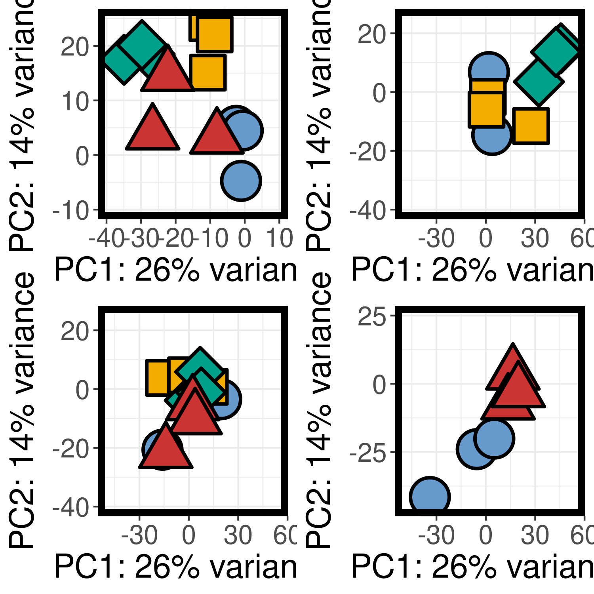

# Transcriptomics Notebook

**Course:** Intro to Ecological Genomics - Fall 2026

**Name:** Issy Timberlake

------------------------------------------------------------------------

## 9.15.2026- Setting up lab notebook and learning markdown

-   Setting up transcriptomics notebook

-   Learn how to take notes in markdown

-   Push notes to Github

**Working directory**

`/gpfs1/home/i/t/itimberl/eco_genomics_projects/eco_genomics_2026/transcriptomics`

**Input files**

none

**Output files**

`/gpfs1/home/i/t/itimberl/eco_genomics_projects/eco_genomics_2026/transcriptomics/transcriptomics_ntbk.md`

**Programs/Dependencies**

-   R version 4.5.1

-   R-studio

**Scripts:**

``` {.R .R}
print("Hello World!")
```

**Graphs/Images:**

| Col1 | Col2 | Col3 |
|------|------|------|
| x    | y    | z    |
| x    | y    | z    |
| x    | y    | z    |

: trying a table out


**Notes/Observations:\
**cool graph; good to look back on later

next, I will use this for real data analysis!

------------------------------------------------------------------------

## 9.15.2026- Introducing the study system

**Working directory:**

`/gpfs1/home/i/t/itimberl/eco_genomics_projects/eco_genomics_2026/transcriptomics`

**Input files:**

**Output files:**

**Programs/Dependencies:**

-   R version 4.5.1

-   R-studio

**Notes/Observations:\
**

------------------------------------------------------------------------

## 9.17.2026- Introducing the study system and how the data was prepared through Illumina

**Working directory:**

`/gpfs1/home/i/t/itimberl/eco_genomics_projects/eco_genomics_2026/transcriptomics`

**Input files:**

none

**Output files:**

none

**Programs/Dependencies:**

-   R version 4.5.1

-   R-studio

-   Command Shell

**Notes/Observations:**

-   Questions we could ask/hypotheses...

    -   look for changes in GE in response to stressor

    -   change in gene expression through time/generations

    -   which treatment is most impactful

    -   which changes are most stable

    -   what overlaps occur across treatments

    -   Plasticity vs. Adaptive Evolution

    -   Phenotype Integration and correlation with genes

    -   Additive, synergistic, or antagonistic interactions between treatments?

-   Starting with uploading data through DESeq2

-   Looking at raw data Phred Q score, it is good to see letters (such as I)... shows high score... symbols show low scores

## 9.22.2026- Setting up R environment and loading data

**Working directory:**

`/gpfs1/home/i/t/itimberl/eco_genomics_projects/eco_genomics_2026/transcriptomics`

**Input files:**

none

**Output files:**

none

**Programs/Dependencies:**

-   R version 4.5.1

-   R-studio

-   Command Shell

-   DESeq2

**Notes/Observations:**

-   Adding startup to our R directories

    ```         
    setup.sh
    ```

-   Also, add the command "load ecogen-rlibs" under Module when starting an R session

-   Copied data from directory:

    ```         
    /gpfs1/cl/biol3990/Transcriptomics/CountsMatrix
    ```

-   Put data under new mydata folder

-   Created an R script to load data and view it as a matrix using DESeq2

-   Imported libraries and data

    -   needed to get rid of decimal points for DESeq2

    -   reads matrix file containing genes x samples and conditions file listing the treatment and generation of each sample

-   Explored patterns in the data

    -   Saw an average of 14687388 reads per sample

    -   see a variance in the number of count means per sample... for example. AAF11Rep3 has the lowest amount of reads while AAF2Rep3 has the highest... this variance due to sequencing effort and efficiency, show technical artifacts of sequencing depth and output; or could show low quality reads

    -   also see variance in counts per genes... average of 8217.81 reads per gene, but a median of 377 reads per gene

        -   this shows presence of some high outliers

        -   most genes show close to zero (to 1000) counts

-   Start working with DESeq2 and creating a DESeq data object

    -   

        ```{r}
        dds <- DESeqDataSetFromMatrix(countData = countsTableRound, colData=conds, 
                                      design= ~ generation + treatment)
        ```

-   Filter data... want at least 15 reads in 75% of samples.

    -   Now have 25,260 transcripts

-   Run the DESeq model to test for differential expression using DESeq(dds)

    -   accounts for size differences, dispersions, gene estimates, mean-dispersion

    -   fits a model and applies statistical tests

-   Results of dds:

    ```         
    [1] "Intercept"            "generation_F11_vs_F0" "generation_F2_vs_F0"  "generation_F4_vs_F0" 
    [5] "treatment_OA_vs_AM"   "treatment_OW_vs_AM"   "treatment_OWA_vs_AM" 
    ```

-   Each of those results were tested for

-   Now, visualizing the data

    -   first, transform the data

        -   "normalize" through log transformation

        -   look at meanSD plot

        -   also variance stabilizing transformation

    -   make a heatmap of pairwise differences between samples to look for outliers

        -   see sample (38) x sample (38)

        -   see F2 is a bit of an outlier... looks very light compared to other samples

    -   make a sample tree

        -   look at relationships between samples

        -   again see AH_F2_Rep2 as an outlier... looking back at histogram of average count per sample, see that it has low counts

    -   make a PCA plot

        -   one general, but then split up by generation to make it easier to visualize

        -   Principal Component 1 always describes most of the variance... see most differences along x-axis

    -   {width="300"}

-   Note on RStudio: dev.off() resets the plot viewing panel

## 9.24.2026- Going over what we have learned

**Working directory**

`/gpfs1/home/i/t/itimberl/eco_genomics_projects/eco_genomics_2026/transcriptomics`

**Input files**

none

**Output files**

`/gpfs1/home/i/t/itimberl/eco_genomics_projects/eco_genomics_2026/transcriptomics/transcriptomics_ntbk.md`

**Programs/Dependencies**

-   R version 4.5.1

-   R-studio

**Notes/Observations**

1) Where things are

2) How to move around -\> using bash commands

-   PATHs: "\~" is home directory shortcut... "/users/i/t/itimberl", containing "/eco_genomics_projects/eco_genomics_2026/transcriptomics/mydata" (+ /myresults + myscripts)

-   also: "/gpfs1/cl/biol3990" is class directory, containing "transcriptomics/CountsMatrix.txt"

-   also: "gpfs1/cl/ecogen" containing "/sw/setup.sh"

3) How to tell the computer what to do (bash, R, etc)

-   cp = copy

-   tab to complete

4) How to back up and share work -\> Github

Also, played in R to understand basic R functions.

Learned to create sections in an R script

```{r}

# Playing in R ####
# 4 hashtags adds a section! appears at bottom of script (or cntrl+shift+R)

```

Then, looked at DESeq functions that we looked at on Tuesday.

```{r}
# Import the counts matrix
countsTable <- read.table("mydata/salmon.isoform.counts.matrix.filteredAssembly", header=TRUE, row.names=1)
# parameters of above read.table() function shows my file has a header, row names are the first column
head(countsTable)
dim(countsTable)
# 67916 genes, 38 samples
```

## 9. .2026- 

-   template

**Working directory**

`/gpfs1/home/i/t/itimberl/eco_genomics_projects/eco_genomics_2026/transcriptomics`

**Input files**

none

**Output files**

`/gpfs1/home/i/t/itimberl/eco_genomics_projects/eco_genomics_2026/transcriptomics/transcriptomics_ntbk.md`

**Programs/Dependencies**

-   R version 4.5.1

-   R-studio

**Notes/Observations**
